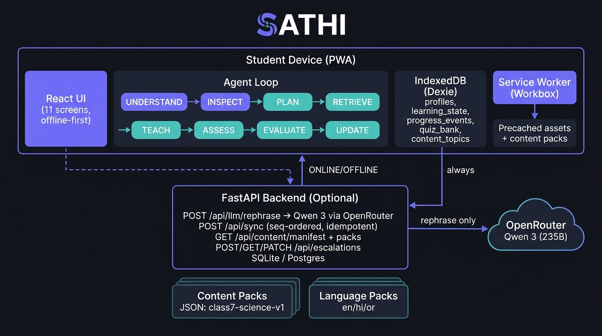

# SATHI — Smart AI Teaching and Helpful Intelligence

> **Offline-first multilingual AI learning agent for Classes 1–12**  
> Built for the NMIET Hackathon 2026 · BSE-Odisha board · Class 7 Science demo

[](#tests)
[](#offline-mode)
[](#language-support)

---

## Architecture



SATHI runs the full teaching agent **on-device** — no internet required after the first load.
The FastAPI backend is optional: it adds LLM rephrasing (Qwen 3 via OpenRouter) and cloud sync, 
but going offline never breaks learning.

---

## Quick Start

### Prerequisites
- Node 20+ and npm
- Python 3.11+
- (Optional) OpenRouter API key for Qwen 3 LLM rephrasing

### 1. Validate content pack

```bash
cd content
python tools/validate_pack.py packs/class7-science-v1.json
# Expected: ✓ All checks passed
```

### 2. Start the backend

```bash
cd backend

# Create virtual environment
python -m venv .venv
.venv\Scripts\activate          # Windows
# source .venv/bin/activate     # Linux/Mac

# Install dependencies
pip install -r requirements.txt

# Configure environment
copy .env.example .env
# Edit .env and add your OPENROUTER_API_KEY

# Run server
uvicorn app.main:app --reload --port 8000
# API docs: http://localhost:8000/docs
```

### 3. Start the frontend

```bash
cd frontend
npm install
npm run dev
# Open: http://localhost:5173
```

---

## Environment Variables (`.env`)

| Variable | Default | Description |
|---|---|---|
| `OPENROUTER_API_KEY` | _(empty)_ | OpenRouter key for Qwen 3 (`sk-or-...`) — optional |
| `QWEN_MODEL` | `qwen/qwen3-235b-a22b` | Which Qwen model to use |
| `DATABASE_URL` | `sqlite:///./sathi.db` | DB connection (swap to `postgresql://` for prod) |
| `CONTENT_PACKS_DIR` | `../content/packs` | Path to JSON content packs |
| `CORS_ORIGINS` | `http://localhost:5173` | Comma-separated frontend origins |
| `ENVIRONMENT` | `development` | `development` or `production` |

> **Without `OPENROUTER_API_KEY`:** The backend falls back to template-based explanations automatically. The app works 100% offline with no key.

---

## Offline Mode (MR-44)

SATHI is a Progressive Web App. After the first page load, it works completely offline.

**Test offline mode in Chrome:**
1. Open Chrome DevTools (F12)
2. Go to **Application → Service Workers**
3. Check **Offline** box
4. Reload the page — SATHI should load in under 3 seconds
5. Complete a full learning session: topic → explanation → quiz → feedback

**Test in airplane mode:**
1. Install the PWA on an Android phone (Chrome → "Add to Home Screen")
2. Open the PWA while online to pre-warm the cache
3. Enable Airplane Mode
4. Open SATHI from the home screen — full learning loop works

---

## Language Support

| Language | Code | UI | Content | Voice (TTS/STT) |
|---|---|---|---|---|
| English | `en` | ✅ | ✅ | ✅ Chrome/Edge |
| Hindi | `hi` | ✅ | ✅ | ✅ Chrome/Edge |
| Odia | `or` | ✅ | ✅ | ⚠️ Limited (see Known Limitations) |

---

## Browser Support Matrix (MR-43)

| Browser | Support Level | Notes |
|---|---|---|
| Android Chrome 90+ | **Primary** ✅ | Full test suite; recommended for demo |
| Android System WebView 90+ | **Primary** ✅ | Same engine as Chrome |
| Desktop Chrome / Edge (demo laptop) | **Primary** ✅ | Demo environment |
| iOS Safari 16+ | **Best-effort** ⚠️ | IndexedDB eviction risk; Background Sync absent |
| Firefox Desktop | **Best-effort** ⚠️ | No Background Sync; storage persistence varies |

---

## Project Structure

```
NMIET-Hackathon/
├── content/                  # Phase 1 — Content & Language Data
│   ├── schema/               # JSON Schema for packs and language packs
│   ├── packs/                # class7-science-v1.json (photosynthesis + plant parts)
│   ├── languages/            # en.json, hi.json, or.json
│   ├── tools/                # validate_pack.py
│   └── docs/                 # AUTHORING_GUIDE.md
├── frontend/                 # Phase 2/3 — React PWA
│   └── src/
│       ├── agent/            # Orchestrator, planner, mastery, 12 tools, 9 nodes
│       ├── analytics/        # metrics.ts — pure analytics functions (MR-81)
│       ├── db/               # Dexie schema + typed repo
│       ├── i18n/             # Language loader + template renderer
│       ├── net/              # Network manager (4-state machine)
│       ├── profiles/         # Profile manager (MR-01 multi-profile)
│       ├── storage/          # Storage monitor (MR-40/41)
│       ├── sync/             # Sync engine (MR-50 seq-ordered)
│       ├── trace/            # Trace recorder + model
│       └── ui/               # 11 screens + 13 shared components
├── backend/                  # Phase 4 — FastAPI
│   └── app/
│       ├── routers/          # health, sync, llm, content, escalations
│       ├── services/         # llm_gateway (Qwen 3), sync_service, content_service
│       ├── models/           # SQLAlchemy models
│       └── schemas/          # Pydantic request/response schemas
└── docs/                     # Architecture diagram, API.md, PRD, technical docs
```

---

## API Reference

Full endpoint documentation: **[docs/API.md](docs/API.md)**

Quick reference:

| Method | Path | Description |
|---|---|---|
| `GET` | `/api/health` | Server health + pack version |
| `POST` | `/api/sync` | Upload pending progress events (max 50, 64 KB) |
| `POST` | `/api/llm/rephrase` | Rephrase curriculum text via Qwen 3 |
| `GET` | `/api/content/manifest` | List available content packs |
| `GET` | `/api/content/packs/{id}` | Download a content pack |
| `POST` | `/api/escalations` | Create teacher escalation |
| `GET` | `/api/escalations/{id}` | Check escalation status |
| `PATCH` | `/api/escalations/{id}/reply` | Teacher replies |

Interactive docs: `http://localhost:8000/docs` (when backend is running)

---

## Demo: Priya (Class 7, Odia, Photosynthesis)

The app ships with a pre-built demo seed profile:

| Field | Value |
|---|---|
| Name | Priya |
| Avatar | 🌻 |
| Class | 7 |
| Board | BSE-Odisha |
| Language | Odia |
| Subjects | [Science] |
| Demo topic | Photosynthesis |
| Initial mastery | 0.3 (30%) |
| Study time | 10 min |

**Load the demo:** Open the app → Profile Picker → select **Priya** → start learning.

To reset: Settings → Clear Data → Priya → Confirm.

---

## Tests

```bash
cd frontend
npm test
# 93 passed, 0 failed (10 test files)
```

| Layer | Coverage |
|---|---|
| Unit | Planner (9 rules + modifiers), mastery formula, alias index, storage monitor, metrics, shuffle, no-repeat, bank-size |
| Integration | Profile isolation, resume interrupted quiz, progress event seq ordering |
| (Manual E2E) | Cold-start offline < 3 s, full demo path, gap-viz bands |

---

## Known Limitations (MR-94)

1. **Odia voice (TTS/STT):** Browser TTS support for Odia is limited. Text fallback is always active; voice is best-effort.
2. **iOS Safari — storage eviction:** IndexedDB data may be cleared by the OS when storage is low. Background Sync API is absent. Risk is documented in the UI.
3. **Single subject:** This demo pack covers Science (Class 7) only. Adding subjects requires a new content pack.
4. **Profile limit:** Maximum 5 profiles per device (IndexedDB storage budget).
5. **Guess detection (MR-23):** Deferred to P2. Fast-tap answers currently receive full credit.
6. **Parent summary (MR-62):** Deferred to P2.
7. **Data export/import (MR-52):** Deferred to P2.

---

## Demo Rehearsal Checklist

- [ ] Deploy 24 hours before the demo
- [ ] Install PWA on Android Chrome demo phone
- [ ] Pre-warm: open app online so Service Worker caches everything
- [ ] **Cold-start test:** airplane mode → open PWA → Home loads in < 3 s
- [ ] Full offline loop: topic → explanation → quiz → feedback
- [ ] Reconnect: syncing badge appears, events upload, seq order correct
- [ ] Gap Visualization: strong/developing/weak colour bands correct
- [ ] Trace page: 7+ steps visible with tool names
- [ ] Debug panel (`?debug=1`): storage estimate < 25 MB
- [ ] Backup: screen-recorded 4-minute demo video saved

---

## License

Content pack (`class7-science-v1.json`): **CC-BY-4.0** — Original team-authored text.  
Code: **MIT**
