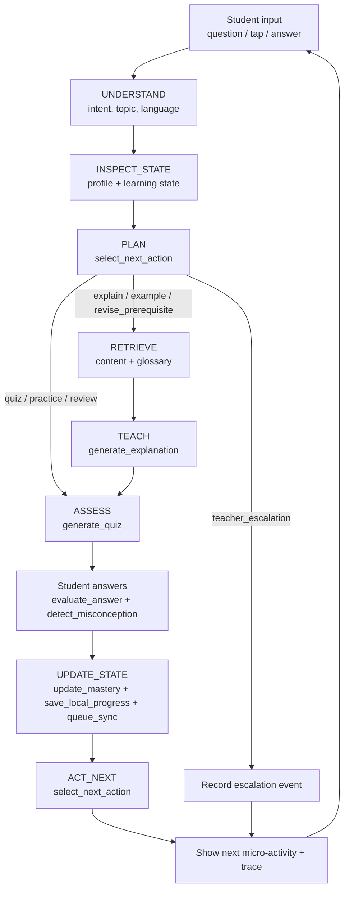
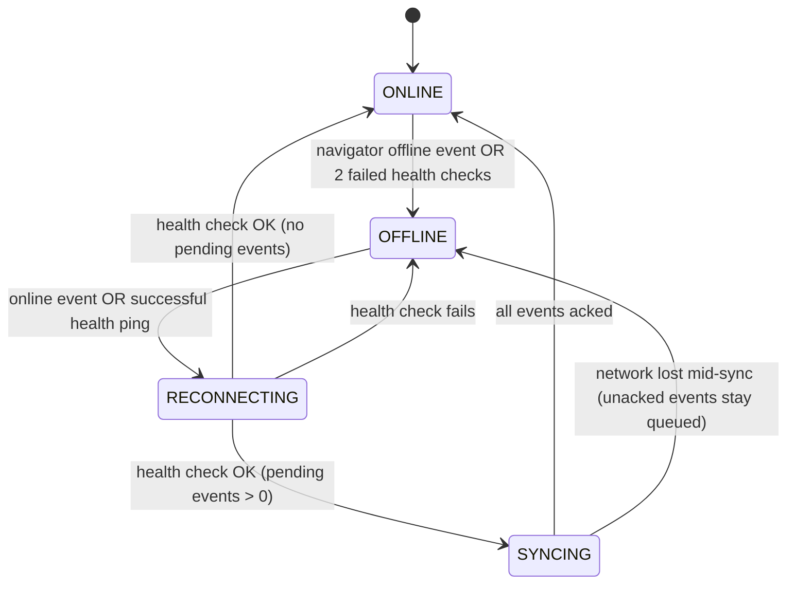

# SATHI: Workflow Specification

This document defines how SATHI behaves step by step: the agent loop, planner rules, mastery math, offline/sync flows, error handling and the live demo script.

---

## 1. Agent Core Loop

**Style:** deterministic educational workflow with AI-assisted nodes. The graph is fixed and testable; the LLM is used only inside specific nodes (and only when online).

```
UNDERSTAND -> INSPECT_STATE -> PLAN -> RETRIEVE -> TEACH
     -> ASSESS -> UPDATE_STATE -> ACT_NEXT -> (loop or end)
```



### Node responsibilities

| Node | What it does | Tools called | Output |
|---|---|---|---|
| UNDERSTAND | Classify intent (`ask_concept`, `practice`, `review`, `unknown`); map to topic ID via keyword/alias index (embedding search optional online) | `get_student_profile` | `{intent, topic_id, language, confidence}` |
| INSPECT_STATE | Load mastery, misconceptions, attempts, last action | `get_learning_state` | `LearnerState` snapshot |
| PLAN | Rule-based planner picks action | `select_next_action` | `{action, reason}` |
| RETRIEVE | Fetch verified content, prerequisites, glossary | `retrieve_curriculum_content`, `get_glossary` | `ContentBundle` |
| TEACH | Produce explanation in target language | `generate_explanation` | Explanation + glossary chips |
| ASSESS | Produce 2-3 questions | `generate_quiz` | `Question[]` |
| (answer) | Score answer, classify misconception | `evaluate_answer`, `detect_misconception` | `AssessmentResult` |
| UPDATE_STATE | Recompute mastery, weak areas, persist, enqueue | `update_mastery`, `save_local_progress`, `queue_sync` | New `LearnerState` |
| ACT_NEXT | Choose next micro-activity from **updated** state | `select_next_action` | `{action, reason}` |

**Guard rails:** every node has a timeout, a max-retry of 2, and a defined fallback (Section 7). The graph never dead-ends; the worst case renders a static cached explanation.

---

## 2. Intent and Topic Detection

1. Normalize input (Unicode NFC, trim, lowercase for Latin).
2. Match against the **alias index** built from the content pack (each topic lists aliases in every language, e.g. `photosynthesis`, `प्रकाश संश्लेषण`, Odia term).
3. Score = weighted token overlap. If score >= 0.6, topic accepted.
4. If 0.35 <= score < 0.6, show 2-3 topic chips ("Did you mean...?"); one tap resolves it.
5. If score < 0.35, mark **out_of_pack**: reply with "limited knowledge" message and offer teacher escalation (`teacher_escalation` action).
6. Online only (optional): LLM classifier can improve topic detection, but its output must still map to a valid `topic_id` in the pack.

Minimal typing: the Home screen also shows topic chips, so the demo never depends on free-text parsing.

---

## 3. Planner (`select_next_action`) Rules

Inputs: `mastery` (0-1), `recent_errors`, `misconceptions`, `confidence`, `attempt_count`, `prereq_mastery`, `assessment_result`, `network_status`, `available_time`.

Evaluated **top to bottom, first match wins**:

| # | Condition | Action | Example reason shown to student |
|---|---|---|---|
| 1 | Topic not in pack, or content confidence < threshold | `teacher_escalation` | "This is outside my verified lessons. I saved it for your teacher." |
| 2 | Any prerequisite mastery < 0.4 | `revise_prerequisite` | "First let's revisit Parts of a Plant." |
| 3 | No prior attempts on topic | `explain` | "New topic: let's start with the idea." |
| 4 | Latest assessment shows misconception M | `give_example` (targeted to M) | "You think plants get food from soil. This example will clear it." |
| 5 | Same misconception twice in a row | `revise_prerequisite` or `explain` with simpler level; if 3 repeats, `teacher_escalation` | "Let's slow down and try a simpler way." |
| 6 | Mastery < 0.5 | `practice` (easy questions) | "A little more practice will help." |
| 7 | 0.5 <= mastery < 0.8 | `quiz` (medium) | "Let's check what you know now." |
| 8 | Mastery >= 0.8, last review > 3 days ago | `review` | "Quick review to keep it fresh." |
| 9 | Mastery >= 0.8 | `continue` (next topic) | "Great, ready for the next topic." |
| Modifier | `available_time` < 5 min | Prefer `quiz`/`review` over long `explain` | |
| Modifier | `network_status != ONLINE` | Use template/cached path; never choose an action needing LLM without fallback | |

The planner is a **pure function** so it is unit-testable and its reason string is honest (it is the actual rule that fired, not text generated afterwards).

---

## 4. Mastery and Confidence Update

Per topic (and per concept inside a topic):

```
result      = 1.0 (correct) | 0.0 (incorrect) | 0.5 (partially correct)
difficulty  = 0.8 easy | 1.0 medium | 1.2 hard
alpha       = 0.25 * difficulty         # learning rate
mastery'    = clamp( mastery + alpha * (result - mastery), 0, 1 )
```

- **Misconception penalty:** if a misconception is detected, add it to `misconceptions[]` and reduce mastery by an extra 0.05 (floor 0).
- **Misconception cleared:** if the student answers correctly on two consecutive questions targeting misconception M, remove M and log `misconception_cleared`.
- **Confidence:** rolling average of correctness over the last 5 attempts (0-1).
- **Weak areas:** concepts with mastery < 0.5 or with active misconceptions.
- **Initial mastery:** 0.3 for a new topic (avoids the false certainty of 0 or 0.5).

Because the formula is deterministic, the demo shows a reproducible change (e.g. 0.30 -> 0.19 after a misconception-based wrong answer, then rising after the targeted example and a correct answer).

---

## 5. Assessment Flow

1. `generate_quiz(topic, class, language, mastery)` returns 2-3 questions from the **quiz bank** (pre-authored, per language) chosen by difficulty band and targeted at weak concepts. Online, the LLM may paraphrase a question, but the `expected_answer` and `misconception_map` always come from the pack.
2. Question types: multiple-choice (default, minimal typing), true/false, short answer (matched against accepted answers and keywords).
3. Every wrong option in an MCQ is tagged with a `misconception_id` (e.g. `photo_food_from_soil`). This makes misconception detection deterministic and reliable offline.
4. `evaluate_answer` returns `{correct, confidence, reasoning_category}`.
5. `detect_misconception` maps the chosen distractor (or short-answer keywords) to a misconception, or returns `null`.
6. Feedback text comes from the language pack's `feedback_templates`, parameterized with the misconception explanation.

---

## 6. Offline, Reconnect and Sync

### 6.1 Network state machine



- Detection uses **both** `navigator.onLine` and an active `/api/health` ping (the browser flag alone is unreliable on weak networks).
- Status badge: green Online, grey Offline, amber Reconnecting, blue Syncing with counter ("Syncing 3 of 5").

### 6.2 Offline learning flow
1. Detect network unavailable, then switch to `OFFLINE`.
2. Retrieve content from the local IndexedDB content store.
3. Run the full agent loop using **local tools** and template-based explanation.
4. Run cached quizzes; store answers.
5. Update local mastery immediately.
6. Append a `progress_event` (`sync_status = pending`) via `save_local_progress` and `queue_sync`.

### 6.3 Reconnect and sync flow
1. Health check passes, then `RECONNECTING`.
2. Load pending events ordered by timestamp.
3. **Validate**: schema check, event_id present, timestamp sane.
4. `POST /api/sync` with batch (max 50 events) plus client `device_id`.
5. Server dedupes by `event_id` (idempotent insert), and returns `{accepted[], duplicates[], rejected[], server_state}`.
6. Client marks accepted and duplicate events `synced`, and keeps rejected ones with a reason for the debug view.
7. **Conflict resolution:** events are append-only; mastery is **recomputed from events** (not overwritten). If server-state and local-state differ, the client merges by replaying the union of events in timestamp order.
8. Retry with exponential backoff (1s, 2s, 4s; max 3 tries per cycle). UI stays usable throughout.

---

## 7. Error Handling and Fallbacks

| Failure | Detection | Fallback | User sees |
|---|---|---|---|
| LLM API error or timeout (> 6 s) | fetch timeout / 5xx | Template explanation from content pack | Normal explanation with a small "offline-style answer" tag |
| Network lost mid-request | fetch abort | Switch to `OFFLINE`, re-run turn locally | Badge turns grey; learning continues |
| Content not in pack | topic score < 0.35 | `teacher_escalation` | "Outside my verified lessons. Saved for your teacher." |
| Voice unavailable (P1) | feature detect | Text input | Notice: "Voice not available, please type or tap" |
| Language feature missing | pack lookup miss | Fall back to English/Hindi text with notice | "Some parts are shown in English" |
| Corrupt local DB | integrity check fails on boot | Rebuild from bundled seed content; keep event log if readable | "Refreshing your lessons..." |
| Duplicate sync | server dedupe | Mark synced | Nothing |
| Invalid input | validation layer | Reject with friendly message | Inline hint |

Retries are **bounded** (max 2 for LLM, max 3 for sync). No infinite loops.

---

## 8. Decision Trace

The trace is a **structured event log generated by the workflow itself** (not free-form LLM text, and never raw chain-of-thought). Each step appended by the executor:

```json
{
  "turn_id": "t_0007",
  "network": "OFFLINE",
  "steps": [
    {"node": "UNDERSTAND", "detected": {"intent": "ask_concept", "topic": "photosynthesis", "language": "or"}},
    {"node": "INSPECT_STATE", "tool": "get_learning_state", "state": {"mastery": 0.30, "attempts": 0, "misconceptions": []}},
    {"node": "PLAN", "tool": "select_next_action", "action": "explain", "reason": "rule#3: no prior attempts on this topic"},
    {"node": "RETRIEVE", "tools": ["retrieve_curriculum_content", "get_glossary"], "source": "pack:class7-science-v1"},
    {"node": "TEACH", "tool": "generate_explanation", "mode": "template"},
    {"node": "ASSESS", "tool": "generate_quiz", "questions": 3},
    {"node": "UPDATE_STATE", "tools": ["update_mastery", "save_local_progress", "queue_sync"], "delta": {"mastery": "0.30 -> 0.19"}, "misconception": "photo_food_from_soil"},
    {"node": "ACT_NEXT", "tool": "select_next_action", "action": "give_example", "reason": "rule#4: misconception photo_food_from_soil detected"}
  ]
}
```

**UI:** collapsed by default with a summary line ("5 tools used, next action: Example"), expandable timeline, and a plain-language version in the student's language. A "Show technical view" toggle reveals the JSON for judges (hidden from normal students unless debug mode is enabled).

---

## 9. Language Handling in the Workflow

1. Every node receives `language` from the profile (never from global state).
2. Content retrieval returns the language-specific record when present; otherwise it falls back and flags `fallback_language`.
3. Explanation = `template(language)` filled from content + glossary. If online and LLM is enabled, the LLM **rephrases within constraints** (protected terms list, max length, class reading level) and the output is validated (terms preserved, no new facts) before display; otherwise the template output is shown.
4. Language switch: only the profile `language` changes. Learner state is keyed by `topic_id`, not by language, so mastery is preserved.

---

## 10. Live Demo Script (3-4 minutes)

**Scenario:** Priya, Class 7, Odia medium, Science: Photosynthesis. *Pre-warm:* open the app once online so the service worker and content pack are cached.

| Time | Presenter action | What the audience sees | Backing system event |
|---|---|---|---|
| 0:00-0:20 | State the problem: Odia-medium student, English terms, bad network | Welcome screen | none |
| 0:20-0:50 | Choose Class 7, Science, Odia | UI switches to Odia; profile created | `get_student_profile` |
| 0:50-1:20 | Tap/type "Photosynthesis" | Agent working indicator | `get_learning_state`, `select_next_action` (explain) |
| 1:20-1:50 | Read explanation | Odia explanation with glossary chips (photosynthesis, chlorophyll) | `retrieve_curriculum_content`, `get_glossary`, `generate_explanation` |
| 1:50-2:20 | Take 3-question quiz; **choose "plants absorb food from soil"** on Q2 | Wrong-answer feedback in Odia | `generate_quiz`, `evaluate_answer` |
| 2:20-2:40 | Show mastery bar dropping, misconception label, next-action card "Example" | Mastery 30% to 19%; "Misconception: food from soil" | `detect_misconception`, `update_mastery`, `select_next_action` |
| 2:40-3:10 | **Turn on airplane mode.** Tap the recommended example, retake Q2, answer correctly | Badge turns grey "Offline"; example loads; mastery rises | Same tools, local; events queued (pending: 3) |
| 3:10-3:30 | **Turn network back on** | Amber "Reconnecting", then blue "Syncing 3 of 3", then green "Online" | `queue_sync`, `POST /api/sync` |
| 3:30-4:00 | Open decision trace | Timeline of steps, tools, state deltas, reasons | Trace log |

**Backups:** (1) recorded screen capture of the full flow; (2) a "Demo mode" seed profile that skips onboarding; (3) if the LLM is unreachable, the template path produces an identical-looking flow (which is fine and is itself a demonstration of resilience).

---

## 11. CTO Q&A Cheat Sheet

| Question | Short answer |
|---|---|
| Why an agent, not a chatbot? | It reads state, picks actions through a planner, calls tools, mutates state, and chooses the next step; the LLM is just one optional node. |
| What does it remember? | Per-topic mastery, attempts, misconceptions, confidence, last action, plus the event log. |
| Which tools are called? | 12 tools, shown live in the trace. |
| How is the next action chosen? | A deterministic rule table over updated state (Section 3); the reason shown is the rule that fired. |
| How do you prevent hallucination? | Retrieval-only content, distractor-mapped misconceptions, LLM output validation, out-of-pack escalation. |
| How does offline work? | The whole agent runs on-device against IndexedDB; the network is only for LLM rephrasing and sync. |
| What happens on reconnect? | Idempotent batch sync; mastery recomputed from the union of events. |
| Multiple languages without rewrites? | Language packs (data) plus language-agnostic workflow code. |
| Scaling content? | Add JSON packs by class, subject and language; authoring and validation via schema. |
| Outside the syllabus? | Says so and escalates to a teacher queue. |
| Measuring learning gain? | Pre/post mastery deltas per topic, misconception recurrence rate, next-action completion rate. |
