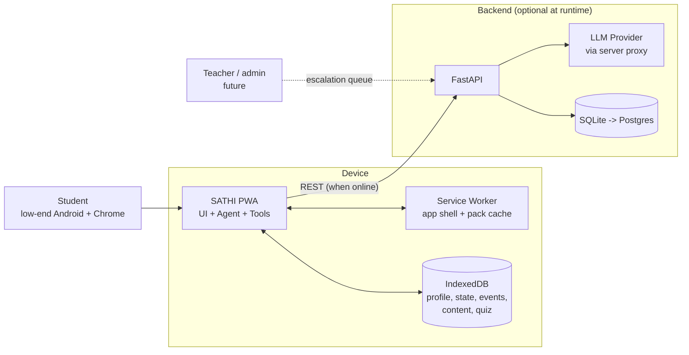
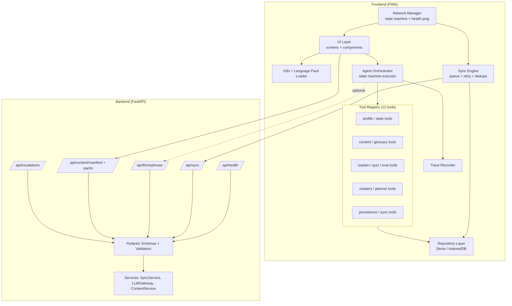

# SATHI: Technical Architecture

---

## 1. Key Architecture Decision

> **The agent runs on the device.** The agent workflow, all 12 tools, the planner, and the learner-state store run inside the PWA in TypeScript against IndexedDB. The backend is **optional at runtime**: it provides (a) LLM rephrasing proxy, (b) sync endpoint, (c) content-pack distribution.

**Why:** "Offline is a normal mode" is only true if the agent itself works offline. If the agent lived on the server, going offline would kill it. This also gives sub-300 ms turns on weak networks and makes the demo immune to Wi-Fi problems.

**Consequence:** the core tools are implemented once, in TypeScript. The server does **not** duplicate the agent; it only validates and stores events, and calls the LLM.

---

## 2. System Context



---

## 3. Component Architecture



### 3.1 Frontend modules

| Module | Responsibility |
|---|---|
| `ui/` | 9 screens; large-target components; zero business logic |
| `agent/orchestrator.ts` | Executes the node graph; owns timeouts/retries; writes the trace |
| `agent/nodes/*.ts` | `understand`, `inspectState`, `plan`, `retrieve`, `teach`, `assess`, `updateState`, `actNext` |
| `agent/planner.ts` | Pure function `selectNextAction(state, result, net)`: rule table |
| `agent/tools/*.ts` | The 12 tool implementations behind a common `Tool<I,O>` interface |
| `agent/mastery.ts` | Pure functions for mastery, confidence and weak-area calculation |
| `content/` | Pack loader, alias index, schema validation |
| `i18n/` | Language-pack loader, template renderer, glossary lookup |
| `net/networkManager.ts` | Online/Offline/Reconnecting/Syncing state machine |
| `sync/syncEngine.ts` | Batching, retry with backoff, idempotency, conflict merge |
| `db/` | Dexie schema, migrations, integrity check, "clear data" |
| `trace/` | Trace model and summary formatter |

### 3.2 Backend modules

| Module | Responsibility |
|---|---|
| `routers/health.py` | `GET /api/health` |
| `routers/sync.py` | `POST /api/sync`: validate and idempotently insert events |
| `routers/llm.py` | `POST /api/llm/rephrase`: guarded LLM proxy (key never on device) |
| `routers/content.py` | `GET /api/content/manifest`, `GET /api/content/packs/{id}` |
| `routers/escalations.py` | `POST /api/escalations` (P1 queue view) |
| `services/llm_gateway.py` | Prompt assembly, timeout, output validation, provider abstraction |
| `services/sync_service.py` | Dedupe, replay, server-state summary |
| `models/` | SQLAlchemy models |
| `schemas/` | Pydantic request/response validation |

---

## 4. Agent Runtime Design

### 4.1 State object (per turn)

```ts
interface AgentContext {
  turnId: string;
  studentId: string;
  input: { type: 'question' | 'tap_topic' | 'answer' | 'next'; text?: string; choiceId?: string };
  profile?: StudentProfile;
  intent?: Intent;                 // set by UNDERSTAND
  topicId?: string;
  learnerState?: LearnerState;     // set by INSPECT_STATE
  plan?: { action: Action; reason: string; ruleId: number };
  content?: ContentBundle;         // set by RETRIEVE
  explanation?: Explanation;       // set by TEACH
  quiz?: Question[];               // set by ASSESS
  assessment?: AssessmentResult;   // set after answer
  network: 'ONLINE' | 'OFFLINE' | 'RECONNECTING' | 'SYNCING';
  trace: TraceStep[];
}
```

### 4.2 Executor pattern

```ts
async function runTurn(ctx: AgentContext): Promise<AgentContext> {
  for (const node of pipelineFor(ctx.input.type)) {
    ctx = await withTimeoutAndRetry(node, ctx, { timeoutMs: node.timeout, retries: node.retries });
    ctx.trace.push(node.lastTraceStep);         // trace written by the executor, not the LLM
  }
  return ctx;
}
```

- Node pipelines: `question -> [understand, inspect, plan, retrieve, teach, assess]`; `answer -> [evaluate, updateState, actNext]`; `next -> [inspect, plan, ...]`.
- Each node is a pure-ish async function `(ctx) => ctx'`, so nodes are independently unit-testable.
- Each tool call goes through a registry wrapper that records name, input hash, output summary, and duration for the trace.

### 4.3 Where the LLM is (and is not) used

| Node / tool | Offline path | Online path (optional) |
|---|---|---|
| understand | Alias index scoring | Same; LLM only for disambiguation, result mapped to valid `topic_id` |
| plan / select_next_action | Rule table | **Same rule table** (never LLM) |
| retrieve | IndexedDB | IndexedDB (plus refresh pack if newer) |
| generate_explanation | Language-pack template + content | LLM **rephrase** with constraints, validated; fallback to template |
| generate_quiz | Quiz bank from pack | Same, optional LLM paraphrase of stems |
| evaluate_answer | MCQ key / keyword match | Same; LLM optional for short-answer scoring only |
| detect_misconception | Distractor to misconception map | Same |
| update_mastery | Deterministic formula | Same |

**Principle:** the LLM can improve fluency but is never required and never decides pedagogy or correctness alone.

### 4.4 LLM output validation (anti-hallucination)

Before an LLM rephrase is shown:
1. All `protected_terms` for the topic (from the glossary) must appear.
2. All numbers and formulas from the source content must be preserved exactly.
3. No named entities or numbers absent from the source content.
4. Length within limit for the class band.
5. Language check (script detection: Odia U+0B00-0B7F, Devanagari U+0900-097F, Latin).
6. On any failure, discard and use the template output.

---

## 5. Data Architecture

### 5.1 Local (IndexedDB via Dexie)

| Store | Key | Notes |
|---|---|---|
| `student` | `id` | Single local profile (anonymous UUID) |
| `learning_state` | `[student_id+topic_id]` | Mastery, confidence, attempts, misconceptions |
| `progress_events` | `event_id` | Append-only; `sync_status` index |
| `content_topics` | `topic_id` | Verified content, all languages |
| `glossary` | `[term_id+language]` | |
| `quiz_bank` | `question_id` | With misconception map |
| `language_packs` | `language_code` | UI strings, templates |
| `meta` | `key` | pack version, device_id, last_sync, schema version |

### 5.2 Local schema (logical)

```ts
Student        { id, class, board, language, subjects[], preferences{ examples:boolean, shortText:boolean }, createdAt }
LearningState  { student_id, topic_id, mastery_score, confidence, attempt_count, correct_count,
                 misconceptions[], last_activity, next_action, updatedAt }
ProgressEvent  { event_id(uuid), student_id, topic_id, event_type, payload, timestamp, sync_status('pending'|'synced'|'rejected'), device_id }
```

`event_type` values: `topic_viewed`, `explanation_shown`, `quiz_answered`, `misconception_detected`, `misconception_cleared`, `mastery_updated`, `next_action_selected`, `escalation_created`, `language_changed`.

### 5.3 Server database (SQLite for MVP, Postgres-ready)

```sql
CREATE TABLE students (
  id TEXT PRIMARY KEY,               -- anonymous UUID
  class INTEGER NOT NULL CHECK (class BETWEEN 1 AND 12),
  board TEXT, language TEXT NOT NULL,
  created_at TEXT NOT NULL
);

CREATE TABLE progress_events (
  event_id TEXT PRIMARY KEY,         -- idempotency key
  student_id TEXT NOT NULL REFERENCES students(id),
  device_id TEXT NOT NULL,
  topic_id TEXT NOT NULL,
  event_type TEXT NOT NULL,
  payload TEXT NOT NULL,             -- JSON
  client_timestamp TEXT NOT NULL,
  received_at TEXT NOT NULL
);
CREATE INDEX idx_events_student_topic ON progress_events(student_id, topic_id, client_timestamp);

CREATE TABLE learning_state_snapshot (   -- derived by replaying events
  student_id TEXT, topic_id TEXT,
  mastery_score REAL, confidence REAL, attempt_count INTEGER, correct_count INTEGER,
  misconceptions TEXT, updated_at TEXT,
  PRIMARY KEY (student_id, topic_id)
);

CREATE TABLE escalations (
  id TEXT PRIMARY KEY, student_id TEXT, topic_or_question TEXT,
  language TEXT, created_at TEXT, status TEXT DEFAULT 'open'
);
```

### 5.4 Content pack format (JSON)

```json
{
  "pack_id": "class7-science-v1",
  "version": "1.0.0",
  "meta": { "class": 7, "board": "CBSE/BSE-Odisha", "subject": "science", "source": "NCERT Class 7 Science (adapted)" },
  "topics": [{
    "topic_id": "photosynthesis",
    "chapter": "Nutrition in Plants",
    "difficulty": 2,
    "prerequisites": ["parts_of_plant"],
    "aliases": { "en": ["photosynthesis"], "hi": ["प्रकाश संश्लेषण"], "or": ["ଆଲୋକ ସଂଶ୍ଳେଷଣ"] },
    "concepts": [{
      "concept_id": "plants_make_own_food",
      "content": {
        "en": "Green plants make their own food using sunlight, water and carbon dioxide...",
        "hi": "...", "or": "..."
      },
      "examples": { "en": ["..."], "hi": ["..."], "or": ["..."] }
    }],
    "misconceptions": [{
      "id": "photo_food_from_soil",
      "description": { "en": "Plants get their food from the soil", "hi": "...", "or": "..." },
      "remediation_example": { "en": "...", "hi": "...", "or": "..." }
    }],
    "quiz": [{
      "question_id": "photo_q2", "difficulty": "medium", "type": "mcq", "concept_id": "plants_make_own_food",
      "stem": { "en": "Where do plants get their food from?", "hi": "...", "or": "..." },
      "options": [
        { "id": "a", "text": {"en":"They make it in leaves using sunlight","hi":"...","or":"..."}, "correct": true },
        { "id": "b", "text": {"en":"They absorb it from the soil","hi":"...","or":"..."}, "misconception_id": "photo_food_from_soil" }
      ]
    }]
  }],
  "glossary": [{
    "term_id": "chlorophyll",
    "term": { "en": "chlorophyll" },
    "gloss": { "en": "green pigment in leaves", "hi": "...", "or": "..." },
    "protected": true
  }]
}
```

Validated with a JSON Schema at build time and at load time; packs failing validation are rejected and the previous version is kept.

### 5.5 Language pack format

```json
{
  "language_code": "or",
  "display_name": "ଓଡ଼ିଆ (Odia)",
  "ui_translations": { "ask_placeholder": "...", "start_quiz": "...", "offline": "...", "syncing": "..." },
  "prompt_templates": { "rephrase": "..." },
  "example_templates": { "everyday": ["..."] },
  "feedback_templates": { "correct": "...", "incorrect_with_misconception": "...{misconception}..." },
  "quiz_templates": { "instruction": "..." },
  "voice_configuration": { "tts": "or-IN", "stt": "or-IN", "available": false }
}
```

New language = new JSON file plus a font subset; no code change.

---

## 6. API Design

Base path: `/api`. JSON only. Validated with Pydantic. All endpoints return typed errors: `{ "error": { "code": "...", "message": "..." } }`.

### `GET /api/health`
```json
200 { "status": "ok", "time": "2026-09-29T10:00:00Z", "pack_version": "1.0.0" }
```

### `POST /api/sync`
Request:
```json
{
  "device_id": "dev_ab12",
  "student": { "id": "stu_9f...", "class": 7, "board": "BSE-Odisha", "language": "or" },
  "events": [
    { "event_id": "evt_...", "student_id": "stu_9f...", "topic_id": "photosynthesis",
      "event_type": "quiz_answered", "payload": { "question_id": "photo_q2", "correct": false, "misconception_id": "photo_food_from_soil" },
      "timestamp": "2026-09-29T10:02:11Z" }
  ]
}
```
Response:
```json
200 {
  "accepted": ["evt_..."], "duplicates": [], "rejected": [{ "event_id": "evt_x", "reason": "unknown_topic" }],
  "server_state": [{ "topic_id": "photosynthesis", "mastery_score": 0.19, "misconceptions": ["photo_food_from_soil"] }]
}
```
Limits: max 50 events per request, max payload 64 KB. Idempotent by `event_id`.

### `POST /api/llm/rephrase`
```json
{ "topic_id": "photosynthesis", "class": 7, "language": "or",
  "source_text": "...", "protected_terms": ["chlorophyll"], "max_words": 90 }
```
Returns `{ "text": "...", "validated": true }` or `422` if validation fails (client uses template). Rate limited per device.

### `GET /api/content/manifest` and `GET /api/content/packs/{pack_id}`
Manifest lists pack ids, versions, sizes, sha256; client downloads only newer packs and verifies checksum.

### `POST /api/escalations`
```json
{ "student_id": "stu_9f...", "topic_or_question": "...", "language": "or" }
```

---

## 7. Offline and Caching Strategy

| Asset | Strategy |
|---|---|
| App shell (HTML/JS/CSS/fonts) | Service worker precache, versioned (cache-first) |
| Content packs | Downloaded on first run to IndexedDB; manifest checked when online (stale-while-revalidate) |
| Fonts (Noto Sans Odia / Devanagari subsets) | Precached, `font-display: swap` |
| API calls | Network-only with timeout; failures route to local path (no blind retries) |
| Sync | Background attempt on `online` event and every 30 s while `RECONNECTING`; Background Sync API where supported, else in-app timer |

**Boot sequence:** register SW, open IndexedDB, integrity check, load language pack, load profile (or onboarding), render. No network required at any step after first install.

**First-run requirement:** the device must complete one online session to cache the shell and packs (the demo pre-warms this).

---

## 8. Network Manager

- Inputs: `window` `online`/`offline` events, `/api/health` ping every 10 s while online (timeout 2 s), and fetch failures.
- Debounce: 2 consecutive failures to go `OFFLINE` (avoids flapping).
- Emits state changes to UI and Sync Engine.
- Exposes `isLLMAvailable()`: true only when `ONLINE` and the last LLM call did not fail recently (circuit breaker: 60 s cool-down after 2 failures).

---

## 9. Reliability Engineering

| Concern | Implementation |
|---|---|
| Timeouts | Node-level (default 3 s local, 6 s LLM) |
| Retries | LLM max 2, sync max 3 with exponential backoff |
| Circuit breaker | LLM gateway disabled 60 s after repeated failure |
| Idempotency | UUID `event_id`; server `INSERT OR IGNORE` |
| Integrity | Schema version and checksum on packs; DB open test; event log validated on boot |
| Graceful errors | Every catch maps to a friendly localized message key |
| Determinism | Planner and mastery are pure functions with unit tests |
| Test hooks | `?debug=1` panel: force offline, force LLM failure, reset profile, seed demo data |

---

## 10. Scalability and Expansion Path

| Dimension | Approach |
|---|---|
| Classes 1-12 | Add packs per class/subject; reading-level bands set template complexity |
| Subjects | Pure data; planner and tools are subject-agnostic |
| Languages | Language packs; glossary-first; voice config per language |
| Content authoring | Authoring CLI validates JSON schema, checks each language has all keys, exports pack + manifest |
| Backend | Stateless FastAPI; SQLite to Postgres; sync events append-only so horizontal scaling is simple |
| Analytics (later) | Derive from event log (mastery deltas, misconception recurrence) |
| On-device AI (later) | Swap `generate_explanation` for a small on-device model behind the same tool interface |
| Teacher loop (later) | Escalation queue and class dashboards read the same event stream |

---

## 11. Repository Structure

```
sathi/
├── README.md
├── docs/
│   ├── 01_PRD.md
│   ├── 02_WORKFLOW.md
│   ├── 03_TECHNICAL_ARCHITECTURE.md
│   ├── 04_TECH_STACK.md
│   ├── 05_SECURITY.md
│   ├── API.md
│   └── DEMO_SCRIPT.md
├── frontend/
│   ├── index.html
│   ├── vite.config.ts
│   ├── public/ (manifest.webmanifest, icons, fonts/)
│   └── src/
│       ├── main.tsx
│       ├── ui/ (screens/, components/)
│       ├── agent/ (orchestrator.ts, planner.ts, mastery.ts, nodes/, tools/)
│       ├── content/ (loader.ts, aliasIndex.ts, schema.json)
│       ├── i18n/ (loader.ts, render.ts)
│       ├── net/networkManager.ts
│       ├── sync/syncEngine.ts
│       ├── db/ (schema.ts, repo.ts, integrity.ts)
│       ├── trace/
│       ├── sw.ts
│       └── __tests__/
├── backend/
│   ├── app/
│   │   ├── main.py
│   │   ├── config.py
│   │   ├── routers/ (health.py, sync.py, llm.py, content.py, escalations.py)
│   │   ├── services/ (llm_gateway.py, sync_service.py, content_service.py)
│   │   ├── models/ ; schemas/ ; db.py
│   │   └── security.py
│   ├── tests/
│   └── requirements.txt
├── content/
│   ├── packs/class7-science-v1.json
│   ├── languages/ (en.json, hi.json, or.json)
│   ├── schema/ (pack.schema.json, language.schema.json)
│   └── tools/validate_pack.py
├── .env.example
└── docker-compose.yml   (optional)
```

---

## 12. Testing Strategy

| Level | What | Tooling |
|---|---|---|
| Unit | planner rules (each rule id), mastery formula, alias matching, template render, LLM validator | Vitest |
| Integration | full turn: question, quiz, wrong answer, mastery change, next action (offline fixtures) | Vitest + fake-indexeddb |
| API | sync idempotency, validation errors, LLM proxy rate limit | pytest + httpx |
| E2E | scripted demo path including offline toggle | Playwright (`context.setOffline(true)`) |
| Manual | real Android phone, airplane mode, Odia rendering, low-memory device | checklist |

**Definition of "demo ready":** the Playwright script for the 4-minute journey passes 10 times consecutively, in both LLM-available and LLM-blocked configurations.
